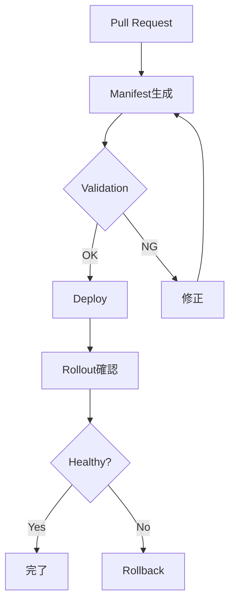
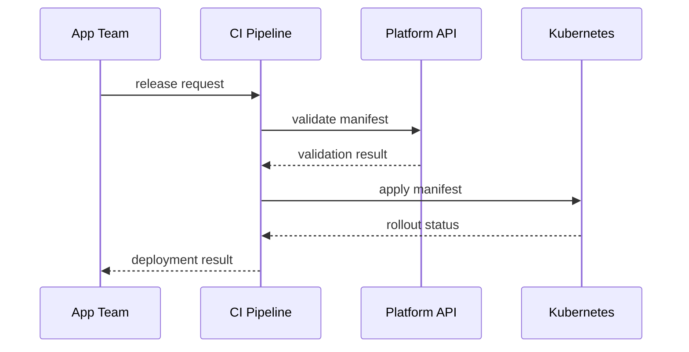

# Markdown記法表示テスト

このページは、Blume上でMarkdown記法がどう表示されるかを確認するためのサンプルです。実ドキュメントに採用する前に、表、コード、Mermaid、HTML、折りたたみ、長い文字列の崩れを確認します。

## 基本文字装飾

通常文、**太字**、*斜体*、~~取り消し線~~、`inline code`、[内部リンク](/procedures/deploy-application) を混在させます。

長い英数字の例: `very-long-release-name-production-web-api-payment-gateway-20260719-build-0001234567890abcdef`

## 見出し階層

### H3の見出し

H3配下の本文です。

#### H4の見出し

H4配下の本文です。目次や余白が崩れないか確認します。

## リスト

番号なしリスト:

- Namespaceは環境ごとに分離する。
- SecretはGitに含めない。
- 本番デプロイ前にチェックリストを確認する。

番号付きリスト:

1. manifestを生成する。
2. platform validationを実行する。
3. productionへデプロイする。
4. rollout statusを確認する。

チェックリスト:

- [x] frontmatterを設定した。
- [x] navigationに追加した。
- [ ] 実画面で崩れを確認する。

## 引用

> 本番環境では、変更内容、rollback方法、影響範囲を事前に確認してください。

> 複数行の引用です。
> 長めの説明が続く場合に、行間と左境界の見え方を確認します。

## 表

通常の表:

| 項目 | 値 | 備考 |
| --- | --- | --- |
| namespace | `app-prod-example` | 命名規約に従う |
| replicas | `3` | productionは2以上 |
| image tag | `2026.07.19-abcdef0` | mutable tagは禁止 |

崩れやすい表:

| 種別 | 長い値 | 説明 |
| --- | --- | --- |
| release name | `payment-gateway-production-blue-20260719-rollback-candidate-000001` | 横幅が狭い画面で折り返し、スクロール、はみ出しを確認する |
| annotation | `platform.example.internal/change-request-id: CHG-2026-000000000000000000000001` | key/valueが長いannotationの表示確認 |
| command | `platformctl deploy --env production --namespace app-prod-example --release payment-gateway --image registry.example.internal/app/payment-gateway:2026.07.19-abcdef0` | codeを含む長いセル |

## コードブロック

Shell:

```bash
platformctl validate --env production --namespace app-prod-example
platformctl deploy --env production --namespace app-prod-example --release payment-gateway
platformctl status --env production --namespace app-prod-example --release payment-gateway
```

YAML:

```yaml
apiVersion: apps/v1
kind: Deployment
metadata:
  name: payment-gateway
  namespace: app-prod-example
  labels:
    app.kubernetes.io/name: payment-gateway
    platform.example.internal/tier: backend
spec:
  replicas: 3
  selector:
    matchLabels:
      app.kubernetes.io/name: payment-gateway
  template:
    metadata:
      labels:
        app.kubernetes.io/name: payment-gateway
    spec:
      containers:
        - name: app
          image: registry.example.internal/app/payment-gateway:2026.07.19-abcdef0
          ports:
            - containerPort: 8080
          readinessProbe:
            httpGet:
              path: /ready
              port: 8080
```

JSON:

```json
{
  "environment": "production",
  "namespace": "app-prod-example",
  "release": "payment-gateway",
  "checks": ["manifest", "policy", "secret", "rollback"]
}
```

## Mermaid

flowchart:



sequence diagram:



## HTML

HTMLの `kbd`、`mark`、`small`、`sub`、`sup` を確認します。

<p>
  <kbd>Cmd</kbd> + <kbd>K</kbd> で検索を開く想定です。
  <mark>重要な語句</mark> の強調表示、
  <small>補足テキスト</small>、
  H<sub>2</sub>O、
  x<sup>2</sup> を表示します。
</p>

HTML table:

<table>
  <thead>
    <tr>
      <th>HTML項目</th>
      <th>値</th>
    </tr>
  </thead>
  <tbody>
    <tr>
      <td>status</td>
      <td><code>ready</code></td>
    </tr>
    <tr>
      <td>message</td>
      <td>HTML table内のinline codeと日本語表示を確認します。</td>
    </tr>
  </tbody>
</table>

## 折りたたみ

<details>
  <summary>デプロイ前チェックの詳細</summary>

  折りたたみ内のMarkdownがどう表示されるか確認します。

  - [本番準備チェックリスト](/app-checklists/production-readiness)
  - [デプロイレビュー](/app-checklists/deployment-review)
  - [ロールバック](/procedures/rollback)

  ```bash
  platformctl diff --env production --namespace app-prod-example
  ```
</details>

<details open>
  <summary>最初から開いた状態</summary>

  このセクションは初期表示で開きます。余白と境界が自然か確認します。
</details>

## 区切り線

上の本文。

---

下の本文。

## 脚注

プラットフォームの制約には根拠ページを付けます。[^constraint]

[^constraint]: 例として [プラットフォーム上限](/constraints/platform-limits) を参照します。

## 画像代替の長いリンクテキスト

[これは非常に長い内部リンクテキストで、表示幅が狭い画面でも折り返しとクリック範囲が崩れないことを確認するためのサンプルです](/operations/document-operations)

## 関連ページ

- [ページテンプレート](/authoring/page-template)
- [ドキュメント運用ルール](/operations/document-operations)
